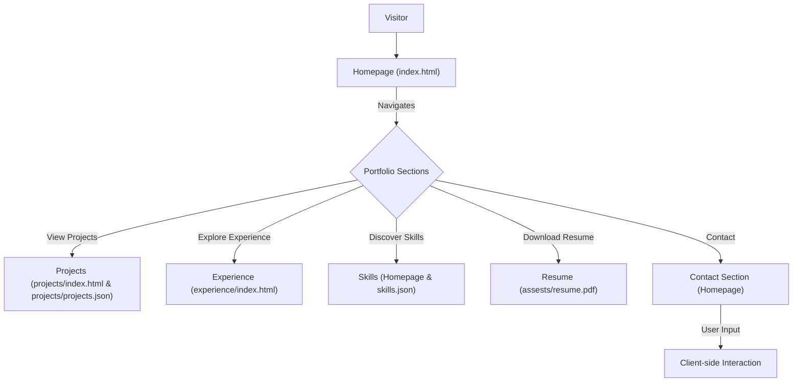

# 🚀 DynamicDev Portfolio Website

<p align="center"></p>

## Short Description
Unleash your professional narrative with `DynamicDev Portfolio`, a sleek, responsive, and highly customizable personal portfolio website. Crafted to showcase your skills, projects, and experience with elegance and impact, this platform provides an immediate, compelling introduction to your professional identity. Built with modern web technologies, it ensures a seamless experience across all devices and a robust foundation for continuous personal branding.

## ✨ Key Features
*   **Stunning Responsive Design:** Adapts flawlessly to desktops, tablets, and mobile devices, ensuring your portfolio always looks impeccable.
*   **Dynamic Project Showcase:** Highlight your work with a dedicated projects section, easily configurable via a `projects.json` file for quick updates.
*   **Comprehensive Experience Timeline:** Present your professional journey and educational background in an engaging, chronological format.
*   **Interactive Skills Display:** Dynamically load and showcase your technical proficiencies using `skills.json` for a clear overview.
*   **Downloadable Resume:** Provide instant access to your full resume (`assests/resume.pdf`) for potential employers and collaborators.
*   **Integrated CI/CD Workflow:** Automated deployment ensures your latest updates are always live and accessible with GitHub Actions.
*   **Engaging User Experience:** Features custom animations (`particles.min.js`), pre-loaders, and a dedicated 404 page for a polished feel.

## Who is this for?
This portfolio website is ideal for:
*   **Software Developers & Engineers:** Showcase your coding prowess and project contributions.
*   **Designers & Creatives:** Display your visual work and design thinking.
*   **Students & Graduates:** Create a strong first impression for internships and entry-level positions.
*   **Freelancers & Consultants:** Market your services and expertise to potential clients.
*   **Anyone seeking a powerful online presence** to highlight their professional achievements.

## Technology Stack & Architecture
This project leverages a modern, client-side technology stack optimized for performance and maintainability:

*   **Frontend:**
    *   **HTML5:** The structural foundation of all web pages.
    *   **CSS3:** Styled with custom CSS (`assests/css/style.css`, `assests/css/404.css`) for a unique aesthetic.
    *   **JavaScript (ES6+):** Powers dynamic content loading, animations, and interactive elements (`assests/js/app.js`, `assests/js/script.js`, `assests/js/particles.min.js`).
*   **Build & Deployment:**
    *   **GitHub Actions:** Automates Continuous Integration and Continuous Deployment (`.github/workflows/ci-cd.yml`) for seamless updates.
*   **Content Management:**
    *   **JSON:** Stores project and skill data (`projects/projects.json`, `skills.json`) for easy content updates without code changes.

## 📊 Architecture & Database Schema
This project functions as a static, client-side application and does not utilize a backend database. Its architecture focuses on efficient content delivery and a dynamic user experience, driven by local JSON data.



## ⚡ Quick Start Guide
Get your personalized portfolio up and running in minutes!

1.  **Clone the Repository:**
    ```bash
    git clone https://github.com/Shivani-mali/portfolio_website.git
    cd portfolio_website
    ```
2.  **Open in Browser:**
    Simply open the `index.html` file in your preferred web browser to view the portfolio locally.
    ```bash
    # For macOS/Linux (might vary)
    open index.html
    # For Windows
    start index.html
    ```
3.  **Customize Your Content:**
    *   Update your personal information, projects, and skills by modifying `projects/projects.json`, `skills.json`, and `assests/resume.pdf`.
    *   Tailor the `index.html`, `experience/index.html`, and `projects/index.html` files to match your specific content needs.
    *   Personalize the look and feel by editing `assests/css/style.css`.
4.  **Deploy (Optional):**
    This is a static site, perfect for deployment on platforms like GitHub Pages, Vercel, Netlify, or AWS S3. The included CI/CD workflow (`.github/workflows/ci-cd.yml`) is pre-configured for GitHub Pages.

## 📜 License
This project is open-source and available under the [MIT License](LICENSE).